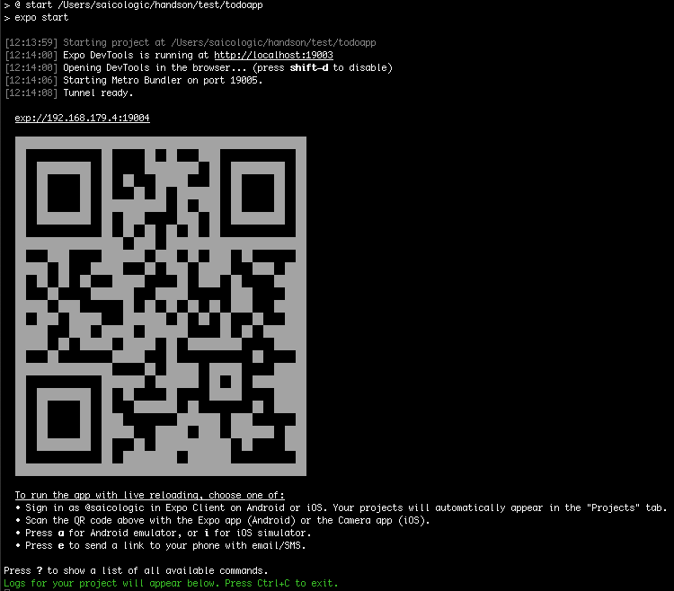
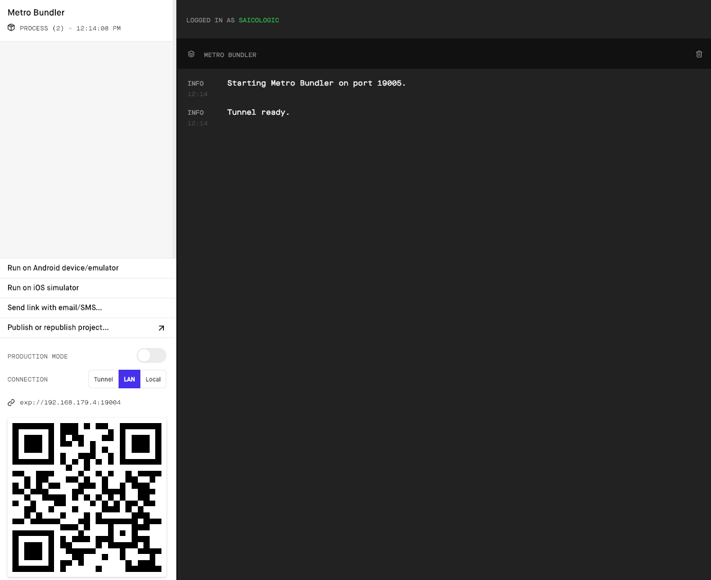
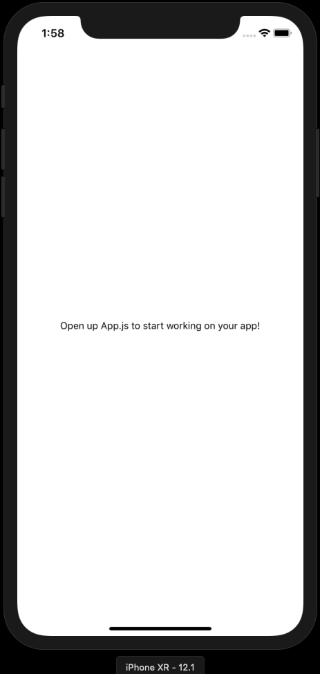
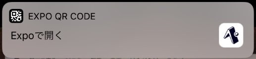

# やること
- Expoのアカウントを取得する
- expo-cliを使ってプロジェクトを作成する
- Metro Bundlerを起動する
- iOS Simulatorで確認する
- 実機で確認する
- 表示を変更する
- Expoの設定
- ログの確認

# 手順

## Expoのアカウントを取得する

Expoの利用には、アカウントの作成が必要です。
[Expo Signup](https://expo.io/signup)でアカウントを作成してください。

## expo-cliを使ってプロジェクトを作成する

```
expo init todoapp
```

`todoapp`を好きな名前を指定してください。

### プロジェクトを選択

今回は、最低限のプロジェクトを作るため`blank`を指定します。

出力結果


### Yarnの設定

今回は、Yarnを使わないので、`N`を入力します。
Noの場合は、npmを使います。

出力結果

```
? Yarn v1.7.0 found. Use Yarn to install dependencies? No
```

### 最終出力結果


## Metro Bundlerを起動する

Metro Bundler( DevTools)を起動します。Metro Bundlerは、主に下記のことができます。

- iOS Simulator/Androidのログを見る
- iOS/Android Simulatorの起動ショートカット
- email/SMSにアプリを起動するためのリンクを送る
- Expo.ioにProjectを公開する(AppStoreやGooglePlayへの公開ではありません)

Metro Bundlerを起動します。

```
cd todoapp
npm start
```

Tips: `npm start`と、`expo start`は同じです。

出力結果



デフォルトに設定してるブラウザでMetro BundlerがのWebページが開きます。



## iOS Simulatorで確認する

`npm start`したあとに、ターミナル上で、iOSの場合は、`i`をタイプします。
(`Press a for Android emulator, or i for iOS simulator`)

iOS Simulatorが起動します。また、ターミナル上でSimulator上にExpoアプリがインストールされます。
数分程度でアプリのインストールが終わり自動でiOS Simualtor上でExpoアプリが起動します。

出力結果

```
[13:49:38] Trying to open the project in iOS simulator...
[13:49:41] Opening iOS simulator
[13:49:43] Downloading latest version of Expo
[13:49:44] Installing Expo on iOS simulator
[13:54:20] Opening exp://127.0.0.1:19000 in iOS simulator

Press ? to show a list of all available commands.
```


`Got it`ボタンを押します。下記の画面が表示されれば成功です。



Tips: Metro Bundlerの、`Run on iOS Simulator`をクリックしても、iOS Simulatorが起動します。

## 実機で確認する（オプション）

### AppStoreからExpoアプリをインストールします。


### QRコードでアプリを起動する
さきほど、`npm start`したときのにターミナル上に表示されている、`QRコード`をカメラアプリで取得します。
もしくは、MetroBundlerの左バーのQRコードも同じです。

Push Notificationが届くので、タップして、Expoを起動します。



あとは、iOS Simualtorと同じです。

# 表示を変更する

プロジェクトを作成すると、下記のファイルが自動生成されています。


この中で、App.jsがエントリーポイントなるファイルです。`App.js`を開きます。

まずは、文章を書き換えてみましょう。

`Open up App.js to start working on your app!`を、`Hello World`に書き換えます。

変更前

```
<View style={styles.container}>
  <Text>Open up App.js to start working on your app!</Text>
</View>
```

変更後

```
<View style={styles.container}>
  <Text>Hello World</Text>
</View>
```

ファイルを保存後、下記の表示がされれば成功です。




# Expoの設定
Simulatorを起動した状態で、`CTRL + D`をタイプします。

下記が表示されます。


デフォルトで、Live Reloadが有効になっているため、コードを修正したら、シミュレーター上で自動で更新されます。

# ログの確認

console.logを出力先は、Metro Bundler上で見れます。


