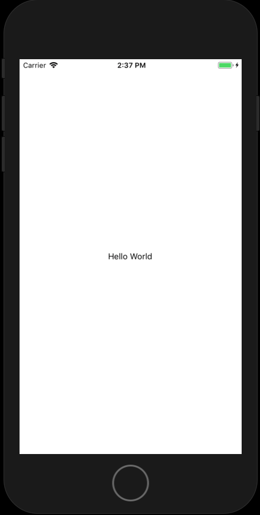
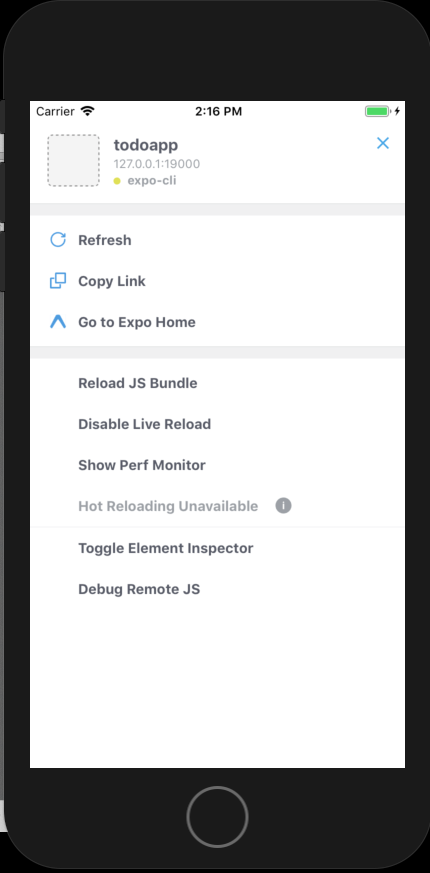
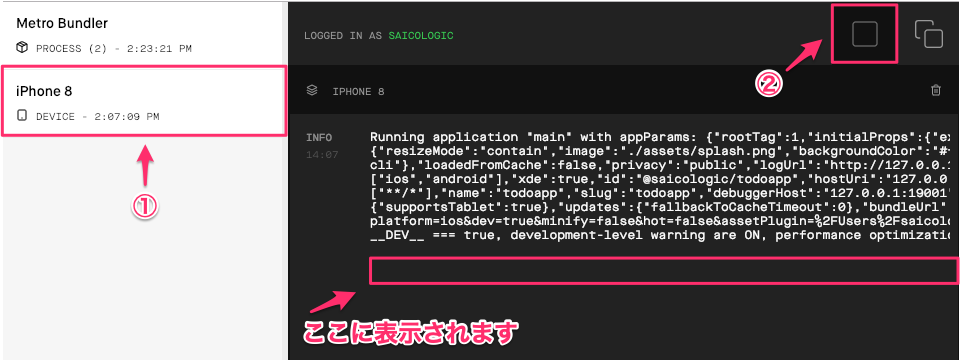

# やること
- 表示を変更する
- Expoの設定
- ログの確認

# 手順

# 表示を変更する

プロジェクトを作成すると、下記のファイルが自動生成されています。


この中で、App.jsがエントリーポイントなるファイルです。`App.js`を開きます。

まずは、文章を書き換えてみましょう。

`Open up App.js to start working on your app!`を、`Hello World`に書き換えます。

変更前

```
<View style={styles.container}>
  <Text>Open up App.js to start working on your app!</Text>
</View>
```

変更後

```
<View style={styles.container}>
  <Text>Hello World</Text>
</View>
```

ファイルを保存後、下記の表示がされれば成功です。




# Expoの設定
Simulatorを起動した状態で、`Command + d`をタイプします。

下記が表示されます。



デフォルトで、Live Reloadが有効になっているため、コードを修正したら、シミュレーター上で自動で更新されます。

# ログの確認

console.logを出力先は、Metro Bundler上で見れます。


