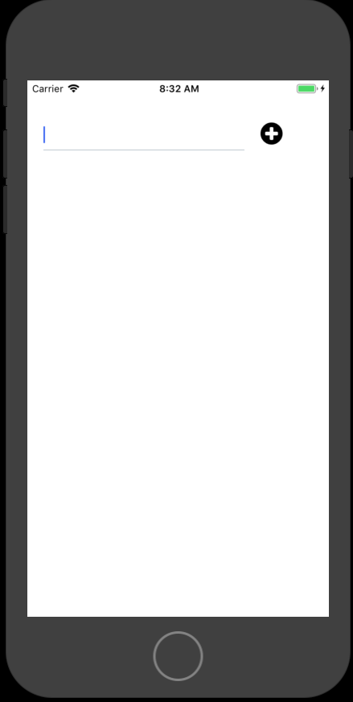

# やること

- 入力フォームを追加する

# 手順

## 入力フォームを追加する

### 必要なパッケージをインストール

入力フォームを表示するのに必要なパッケージをインストールします。

[react-native-elements](https://react-native-training.github.io/react-native-elements/docs/0.19.1/getting_started.html)は、UI Kitです。stable版の0.19.1を使います。
Current Releaseの1.0.0-beta7では動きません。

[react-native-vector-icons](https://github.com/oblador/react-native-vector-icons)は、入力ボタン用のカスタムアイコンライブラリです。

参考: [todoapp:package.json](https://github.com/saicologic/todoapp/blob/master/package.json)

```
npm install react-native-elements@0.19.1 --save
npm install react-native-vector-icons@6.0.2 --save
```


package.jsonに追加されている確認します

変更前

```
  "dependencies": {
    "expo": "^32.0.0",
    "react": "16.5.0",
    "react-native": "https://github.com/expo/react-native/archive/sdk-32.0.0.tar.gz",
  },
```

変更後

```
  "dependencies": {
    "expo": "^32.0.0",
    "react": "16.5.0",
    "react-native": "https://github.com/expo/react-native/archive/sdk-32.0.0.tar.gz",
    "react-native-elements": "^0.19.1",
    "react-native-vector-icons": "^6.0.2"
  },
```

### 入力フォームを追加する

フォームに必要なライブラリを読み込みます。
下記のコードをApp.jsに追加します。

```
import {
  CheckBox,
  FormInput
} from 'react-native-elements';
import Icon from 'react-native-vector-icons/FontAwesome';
```

#### constructor
`export default class App extends React.Component`以下に追記します。
constructorはコンポーネントのコンストラクタです。コンポーネントを初期化するときに呼ばれます。
入力フォームの状態を記録するために、`this.state.text`を定義します。

```
  constructor(props) {
    super(props);

    this.state = {
      text: ''
    };
  }
```

#### render

renderは、必ず定義が必要な関数です。表示処理をおこないます。
return文で、JSXで記述したテキストを返す必要があります。

renderを下記で上書きします。

```
render() {
    const { text } = this.state;

    return (
      <View style={styles.container}>
        <View style={styles.formView}>
          <FormInput
            inputStyle={styles.formInput}
            onChangeText={(changedText) => {
              this.setState({ text: changedText });
            }}
            value={text}
            clearButtonMode="always"
          />
          <Icon
            name="plus-circle"
            size={32}
            onPress={() => {
              this.addItem();
            }}
          />
        </View>
      </View>
    );
  }
```

#### スタイルの変更

スタイルの変更は、、<View>のプロパティで、 `style`に変数を指定することで変更できます。

下記のstylesに上書きします。

```
const styles = StyleSheet.create({
  formView: {
    paddingTop: 30,
    flexDirection: 'row',
  },
  formInput: {
    borderWidth: 0,
    width: 250,
  },
  container: {
    flex: 1,
    height: '100%',
    paddingTop: 20,
    backgroundColor: '#fff',
  },
});
```

例えば、containerで指定したスタイルは、`{styles.container}`でアクセスできます。

### 完了

コードを修正後、ファイルを保存すれば自動で変わります。

Tips: 赤い画面で、renderエラーの表示がされたら、`CTRL + r`で何度かリロードしてみてください。



## 全体コード

package.json

```
{
  "main": "node_modules/expo/AppEntry.js",
  "scripts": {
    "start": "expo start",
    "android": "expo start --android",
    "ios": "expo start --ios",
    "eject": "expo eject"
  },
  "dependencies": {
    "expo": "^32.0.0",
    "react": "16.5.0",
    "react-native": "https://github.com/expo/react-native/archive/sdk-32.0.0.tar.gz",
    "react-native-elements": "^0.19.1",
    "react-native-vector-icons": "^6.0.2"
  },
  "devDependencies": {
    "babel-preset-expo": "^5.0.0"
  },
  "private": true
}
```

App.js

```
import React from 'react';
import { StyleSheet, Text, View } from 'react-native';

import {
  CheckBox,
  FormInput
} from 'react-native-elements';
import Icon from 'react-native-vector-icons/FontAwesome';

export default class App extends React.Component {

  constructor(props) {
    super(props);

    this.state = {
      text: ''
    };
  }

  render() {
    const { text } = this.state;

    return (
      <View style={styles.container}>
        <View style={styles.formView}>
          <FormInput
            inputStyle={styles.formInput}
            onChangeText={(changedText) => {
              this.setState({ text: changedText });
            }}
            value={text}
            clearButtonMode="always"
          />
          <Icon
            name="plus-circle"
            size={32}
            onPress={() => {
              this.addItem();
            }}
          />
        </View>
      </View>
    );
  }
}

const styles = StyleSheet.create({
  formView: {
    paddingTop: 30,
    flexDirection: 'row',
  },
  formInput: {
    borderWidth: 0,
    width: 250,
  },
  container: {
    flex: 1,
    height: '100%',
    paddingTop: 20,
    backgroundColor: '#fff',
  },
});
```

[参考: todoapp:App.js](https://github.com/saicologic/todoapp/blob/master/App.js)
