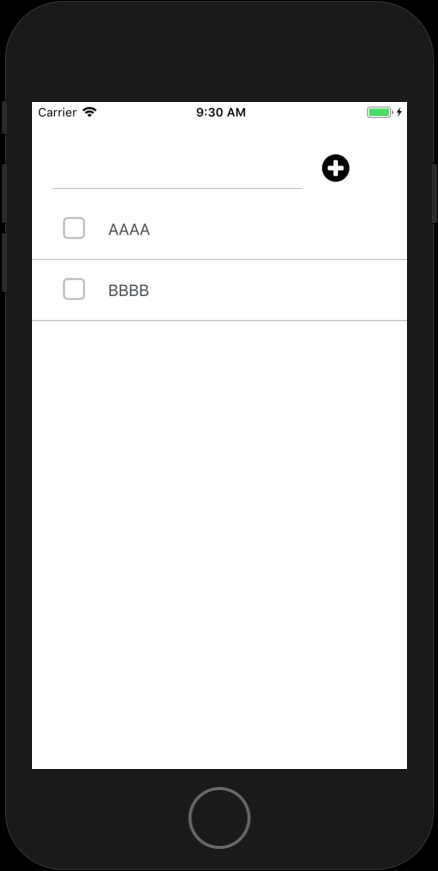

# やること

- TODOリスト表示のフォームを追加する

# 手順

## TODOリスト表示のフォームを追加する

App.jsに追記します。

### ライブラリを追記します。

プロジェクト作成時の`Text`は、削除します。

`FlatList`を追記します。

```
import {
  StyleSheet,
  View,
  FlatList,
} from 'react-native';
```

`ListItem`を追記します。

```
import {
  CheckBox,
  FormInput,
  ListItem,
} from 'react-native-elements';
```


#### 表示用のダミーデータを追加します

itemsに、表示確認用のダミーデータを追記します。

```
this.state = {
  text: '',
  items: [
    {
      content: 'AAAA',
    },
    {
      content: 'BBBB',
    },
  ]
};
```


#### リスト表示の関数を追加します

```
keyExtractor = (item, index) => index.toString()

renderItem = ({ item }) => (
  <View>
    <ListItem
      containerStyle={styles.listItem}
      title={item.content}
      leftIcon={
        <CheckBox
          iconLeft
          size={28}
          containerStyle={styles.checkBox}
          onPress={() => {
            this.completeItem(item);
          }}
          checked={false}
        />}
      hideChevron
    />
  </View>
)
```

#### render

さきほど、this.state.itemsを、取得します。itemsを追記します。

```
const { text, items } = this.state;
```

リスト表示用のコンポーネントを追記します。

```
<View style={styles.todoList}>
  <FlatList
    keyExtractor={this.keyExtractor}
    data={items}
    renderItem={this.renderItem}
  />
</ View>
```

### スタイルを追記します。

#### チェックボックス

```
checkBox: {
  backgroundColor: 'white',
  borderColor: 'white',
  width: 46,
},
```

#### リスト

```
listItem: {
  paddingTop: 0,
  paddingLeft: 0,
  paddingRight: 0,
  paddingBottom: 0,
  borderBottomWidth: 1,
},
```

```
todoList: {
  paddingTop: 10,
},
```

### 完了

コードを修正後、ファイルを保存すれば自動で変わります。



## 全体コード

App.json

```
import React from 'react';
import {
  StyleSheet,
  Text,
  View,
  FlatList,
} from 'react-native';

import {
  CheckBox,
  FormInput,
  ListItem,
} from 'react-native-elements';
import Icon from 'react-native-vector-icons/FontAwesome';

export default class App extends React.Component {

  constructor(props) {
    super(props);

    this.state = {
      text: '',
      items: [
        {
          content: 'AAAA',
        },
        {
          content: 'BBBB',
        },
      ]
    };
  }

  keyExtractor = (item, index) => index.toString()

  renderItem = ({ item }) => (
    <View>
      <ListItem
        containerStyle={styles.listItem}
        title={item.content}
        leftIcon={
          <CheckBox
            iconLeft
            size={28}
            containerStyle={styles.checkBox}
            onPress={() => {
              this.completeItem(item);
            }}
            checked={false}
          />}
        hideChevron
      />
    </View>
  )

  render() {
    const { text, items } = this.state;

    return (
      <View style={styles.container}>
        <View style={styles.formView}>
          <FormInput
            inputStyle={styles.formInput}
            onChangeText={(changedText) => {
              this.setState({ text: changedText });
            }}
            value={text}
            clearButtonMode="always"
          />
          <Icon
            style={styles.plus}
            name="plus-circle"
            size={32}
            onPress={() => {
              this.addItem();
            }}
          />
        </View>
        <View style={styles.todoList}>
          <FlatList
            keyExtractor={this.keyExtractor}
            data={items}
            renderItem={this.renderItem}
          />
        </ View>
      </View>
    );
  }
}

const styles = StyleSheet.create({
  checkBox: {
    backgroundColor: 'white',
    borderColor: 'white',
    width: 46,
  },
  listItem: {
    paddingTop: 0,
    paddingLeft: 0,
    paddingRight: 0,
    paddingBottom: 0,
    borderBottomWidth: 1,
  },
  formView: {
    paddingTop: 30,
    flexDirection: 'row',
  },
  formInput: {
    borderWidth: 0,
    width: 250,
  },
  todoList: {
    paddingTop: 10,
  },
  container: {
    flex: 1,
    height: '100%',
    paddingTop: 20,
    backgroundColor: '#fff',
  },
});
```
