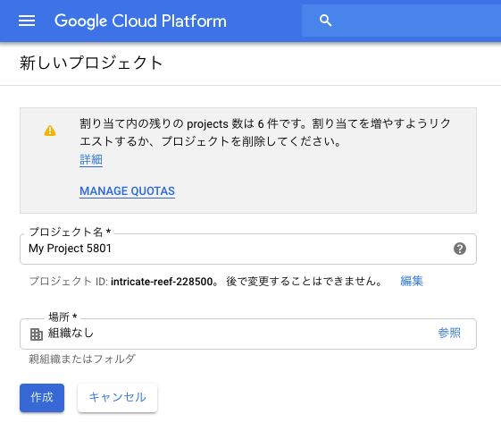
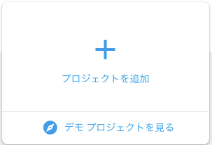
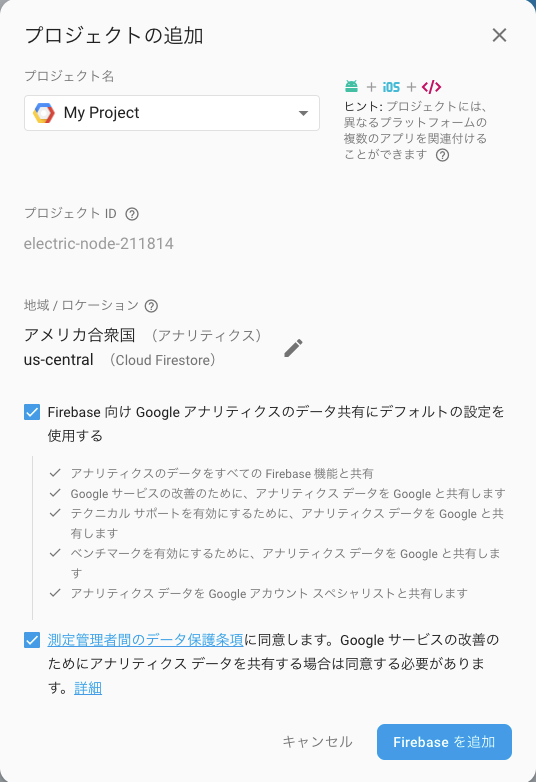
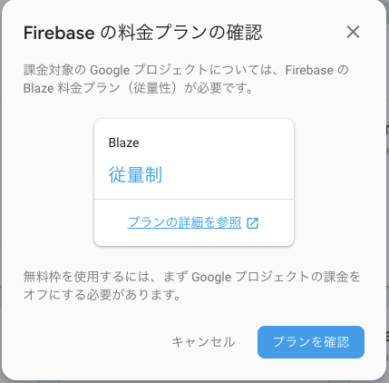
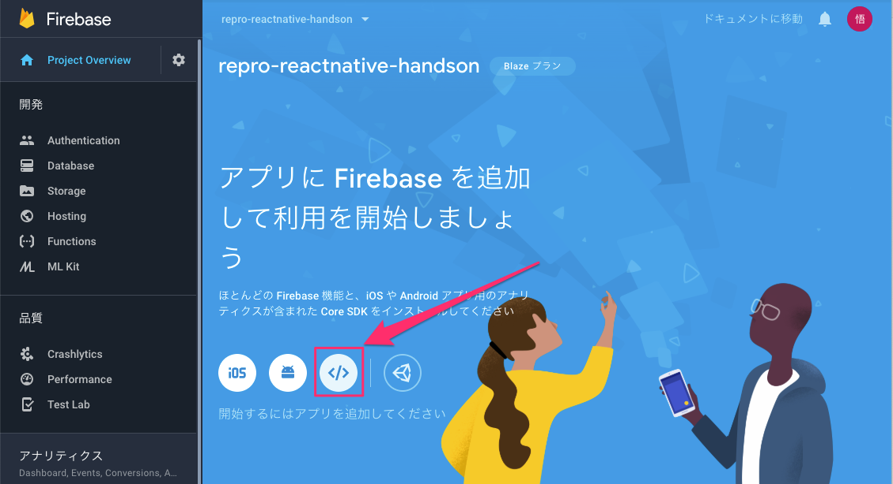
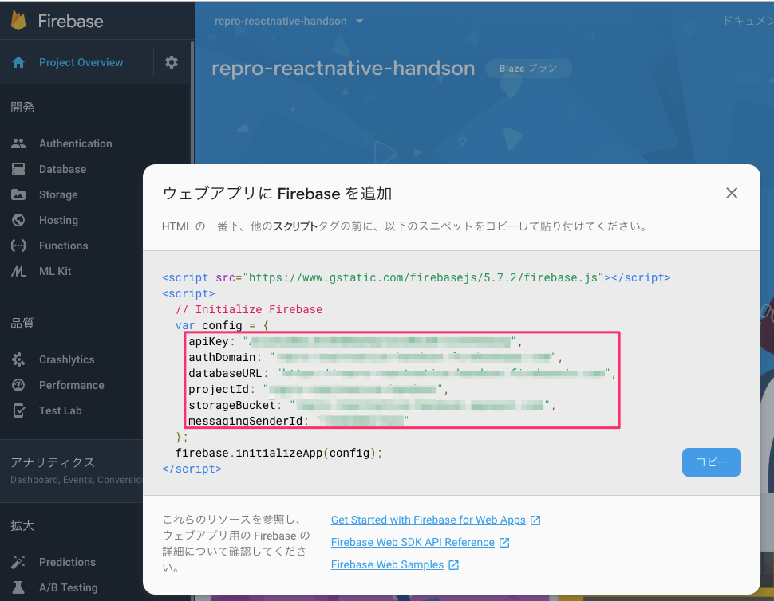
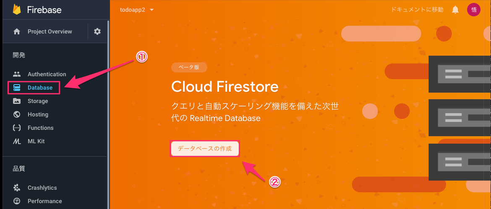
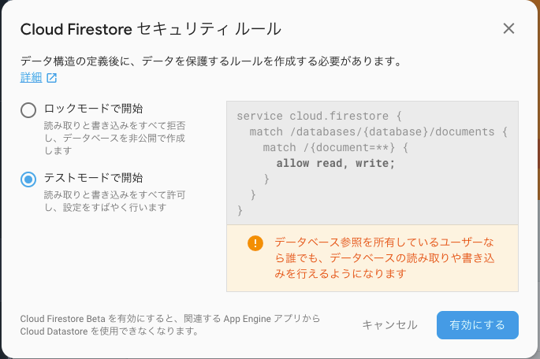
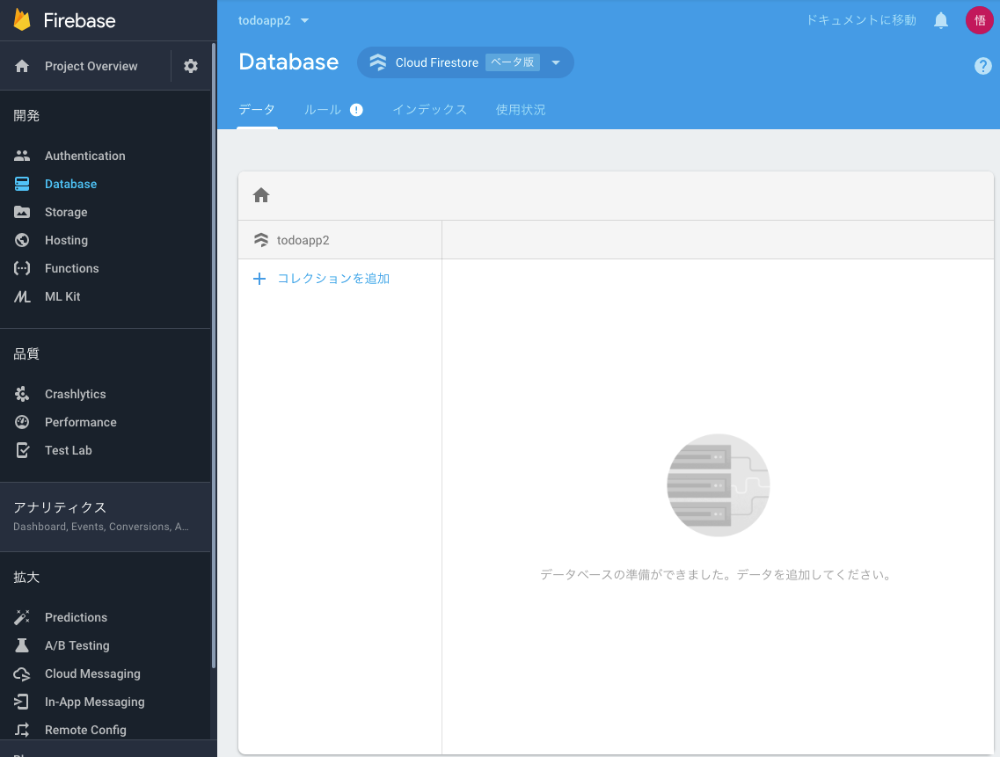

# やること
- Googleのアカウントを取得する
- Google Cloud Platformでプロジェクトを作成する
- ウェブアプリにFirebaseを追加で設定情報を取得する
- app.jsonに設定する

# 手順
## Googleのアカウントを取得する

みんな持ってると思うので

まだ持ってなければこちらから => [アカウント作成](https://accounts.google.com/signup/v2/webcreateaccount?hl=ja&continue=https%3A%2F%2Fmyaccount.google.com%2Fintro&flowName=GlifWebSignIn&flowEntry=SignUp)

## Google Cloud Platformでプロジェクトを作成する

※ https://cloud.google.com/　でコンソールログイン済み

[プロジェクトの作成](https://console.cloud.google.com/projectcreate?previousPage=%2Fiam-admin%2Fsettings%3Fproject%3Drepro-reactnative-handson%26_ga%3D2.12973111.-1010586665.1545205546&organizationId=0)




## Firebaseのプロジェクトを作成する
https://console.firebase.google.com/u/0/?hl=ja

さきほど作成した、プロジェクトを利用して、Firebaseのプロジェクトを作成します。

### プロジェクトを追加




#### プロジェクトの追加



#### 料金プランの確認



## ウェブアプリにFirebaseを追加で設定情報を取得する

### ホーム

ホーム画面のProject Overviewを開きます。最初に表示されるページです。



### 設定情報の取得



下記をコピペします。

- apiKey
- authDomain
- databaseURL
- projectId
- storageBucket
- messageingSenderId

## app.jsonに設定する

app.jsonに追記します。
参考: [todoapp/app.json](https://github.com/saicologic/todoapp/blob/master/app.json#L11-L20)

```
"extra": {
  "firebase": {
    "apiKey": "",
    "authDomain": "",
    "databaseURL": "",
    "projectId": "",
    "storageBucket": "",
    "messagingSenderId": ""
  }
},
```

## Cloud Firestoreでデータベースを作成します。



### データベースの作成

`テストモード`で開始を選択し、`有効にする`を選択します。
※ 必要であれば、セキュリティルールの変更をお願いします。



Simulator等で追記したテキスト（ドキュメント）は、下記の画面で確認できます。
タブにして、閉じないことをオススメします。

