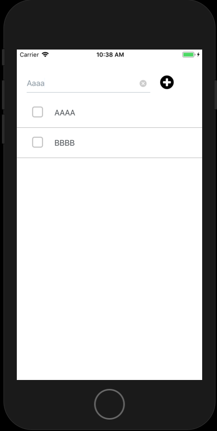
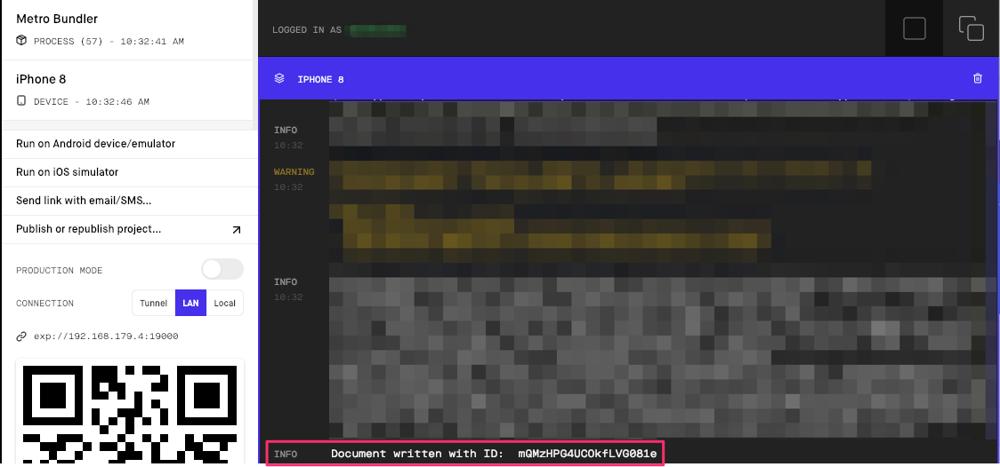
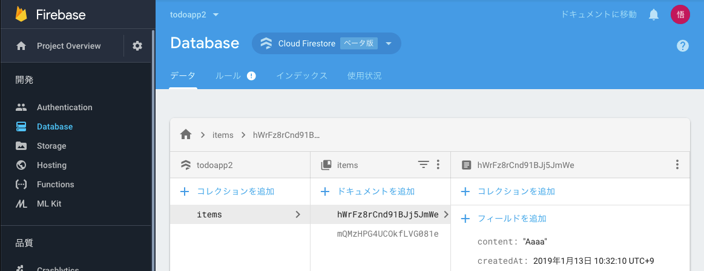

# やること

- Firebase Cloudstoreを設定する
- テキストを保存する
- Simulatorで動作確認
- ログを確認する
- Webコンソールからデータを確認する

# 手順

## Firebase Cloudstoreを設定する


プロジェクト直下に、firebase.jsを作成します。
下記のコードを追記します。

```
import { Constants } from 'expo';
import * as firebase from 'firebase';
import 'firebase/firestore';

class Firebase {
  constructor(config = {}) {
    firebase.initializeApp(config);
    this.firestore = firebase.firestore();
    this.firestore.settings({ timestampsInSnapshots: true });
  }
}

// app.jsonから設定の読み込み
const fire = new Firebase(Constants.manifest.extra.firebase);
export default fire;
```

`Constants.manifest.extra.firebase`で設定ファイルを読み込みます。

## テキストを保存する

App.jsに書きを追記します。

参考: [todoapp:App.js](https://github.com/saicologic/todoapp/blob/master/App.js#L90-L100)

```
addItem = async () => {
  const { text } = this.state;
  const inputText = text;
  if (inputText !== '') {
    await firebase.addItem(inputText);
  }
}
```

firebase.jsに下記を追記します

参考: [todoapp: firebase.js](https://github.com/saicologic/todoapp/blob/master/firebase.js#L12-L21)

```
addItem = async (content) => {
  return this.firestore.collection('items').add({
    content,
    createdAt: new Date(),
  }).then((docRef) => {
    console.log('Document written with ID: ', docRef.id);
  }).catch((error) => {
    console.error('Error adding document: ', error);
  });
}
```

### Simulatorで動作確認



### ログを確認する


`'Document written with ID: `が出力されます。

### Webコンソールからデータを確認する
画面をリロードするとコレクションが追加されていると思います。


