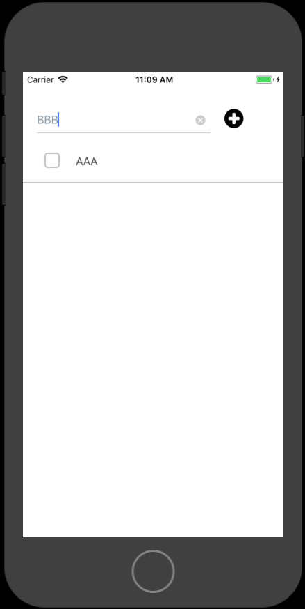

# やること
- 追加したテキストを表示する
  - App.jsの修正
  - firebase.jsの修正
- Simulatorで動作確認

# 手順

## 追加したテキストを表示する

### App.jsの修正

Cloudstoreから取得するので、itemsを空にします。

```
this.state = {
  text: '',
  items: [],
};
```

追加したCloudstoreから取得するための、getItemsを追記します。
参考: [todoapp/App.js](https://github.com/saicologic/todoapp/blob/master/App.js#L102-L112)

```
getItems = async () => {
  firebase.getItems().then((querySnapshot) => {
    const items = [];
    querySnapshot.forEach((doc) => {
      const data = doc.data();
      data.itemId = doc.id;
      items.push(data);
    });
    this.setState({ items });
  });
}
```

起動時にすでに追加済みのリストを表示するため、`componentWillMount`イベントのタイミングで、getItemsを呼び出してリストを更新します。

```
componentWillMount() {
  this.getItems();
}
```

追加時にも、リストを更新するため、addItemを修正します。
参考: [todoapp/App.js](https://github.com/saicologic/todoapp/blob/master/App.js#L94-L98)

```
await this.getItems();
```

フォームをクリアするために、下記を追記します。

```
this.setState({
  text: '',
});
```

### firebase.jsの修正

firebase.jsに、getItemsを追記します。
参考: [todoapp/App.js](https://github.com/saicologic/todoapp/blob/master/firebase.js#L23-L27)

```
async getItems() {
  return this.firestore.collection('items')
    .orderBy('createdAt', 'asc')
    .get();
}
```

## Simulatorで動作確認


