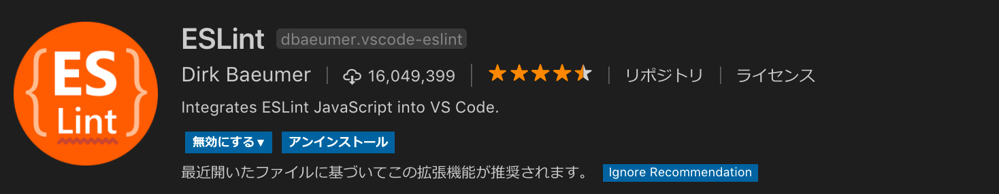
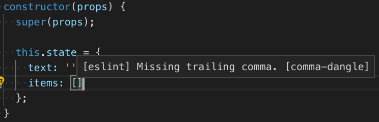

# やること
- eslintの設定
- 設定ファイルを追加
- eslintチェック

# 手順
## eslint関係のパッケージ

[](https://github.com/saicologic/todoapp/blob/master/package.json#L19-L27)


package.jsonのdevDependenciesを下記のように修正します。

参考: [todoapp/package.json](https://github.com/saicologic/todoapp/blob/master/package.json#L21-L26)

```
  "devDependencies": {
    "babel-preset-expo": "^5.0.0",
    "babel-eslint": "^9.0.0",
    "eslint": "^5.5.0",
    "eslint-config-airbnb": "^17.1.0",
    "eslint-plugin-import": "^2.14.0",
    "eslint-plugin-jsx-a11y": "^6.1.1",
    "eslint-plugin-react": "^7.11.1"
  }
```

`npm install`を実行します。


## 設定ファイルを追加

プロジェクト直下に、`.eslintrc.json`ファイルを追加します。

参考: [todoapp/.eslintrc.json](https://github.com/saicologic/todoapp/blob/master/.eslintrc.json)

```
{
  "extends": "airbnb",
  "plugins": [
    "react",
    "jsx-a11y",
    "import"
  ],
  "rules": {
    "react/prefer-stateless-function": 0,
    "react/jsx-filename-extension": 0,
    "react/no-multi-comp": 0,
    "react/jsx-wrap-multilines": 0,
    "implicit-arrow-linebreak": 0,
    "no-console": 0,
    "arrow-body-style": 0
  },
  "parser": "babel-eslint"
}
```

## eslintチェック
vscodeを使っている場合は、ESlintを入れます。



適当に、末尾のカンマをとってみましょう。


